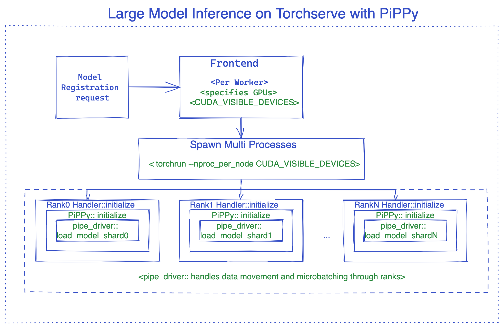
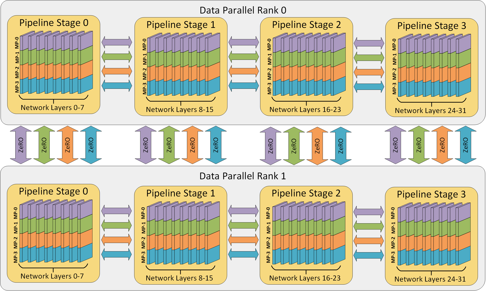

Integration if using PiPPy

https://www.deepspeed.ai/tutorials/pipeline/

It partitions the layers of a model into stages that can be processed in parallel.

Link to [[How pipeline parallelism works]]

