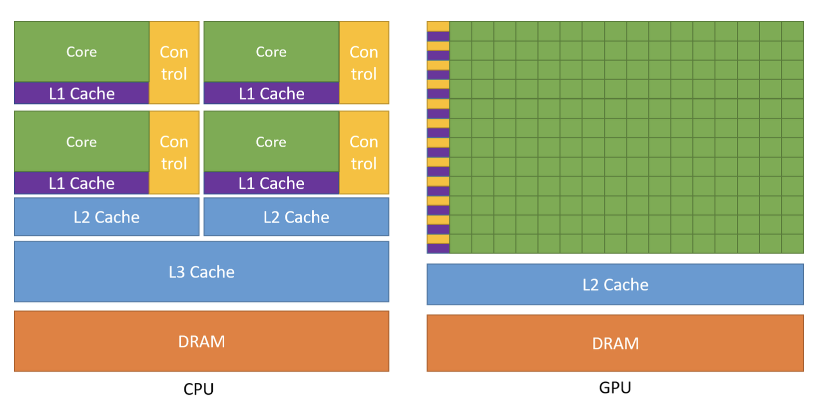
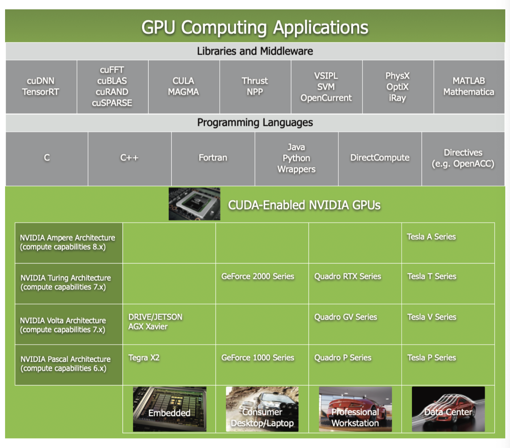
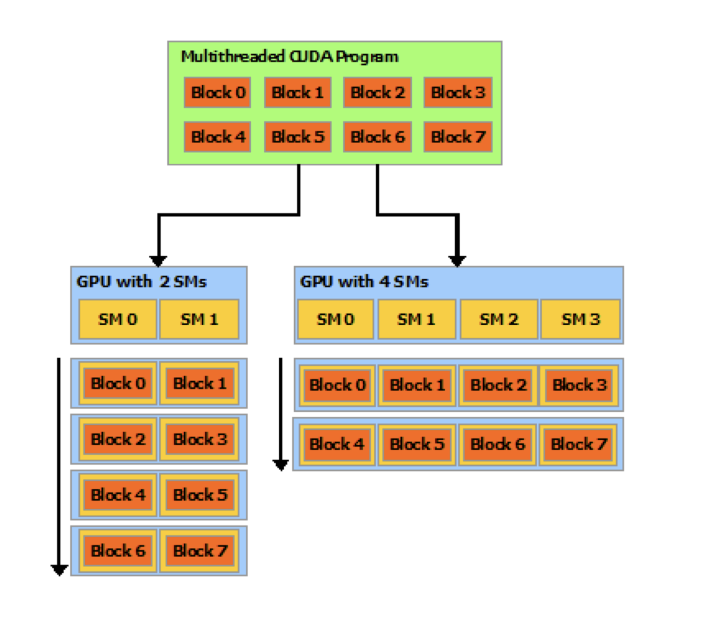

# Learning CUDA

https://docs.nvidia.com/cuda/cuda-c-programming-guide/

## 1. Introduction

- **GPU Application**
  https://www.nvidia.com/en-us/gpu-accelerated-applications/
- FPGAs also energy efficient but don’t offer much programming flexibility

- GPU design for highly parallel computation. More transistors are devote to data processing.
  

## 2. CUDA: General Purpose Parallel Computing Platform and Programming Model

CUDA comes with a software environment that can use C++.
Also available are FORTRAN, DirectCompute, OpenACC.



## 3. Scalable Programming Model

- CUDA parallel programming is design to overcome parallelism problems for GPUs
- Three key abstractions:

  1. hierarchy of thread groups
  2. shared memories
  3. barrier synchronization

- Automatic scalability
  

- GPU is built around an array of [Streaming Multiprocessors (SMs)](#hardware-implementation)

## 4. Document Structure

_just describes document structure_

## 5. Programming Model

Full code for the [vector addition example](#vectorAdd-CUDA-sample)

### Kernels

CUDA C++ extends C++ by allowing programmer to define C++ functions called _kernels_, that when called, are executed N times in parallel by N different _CUDA threads_. This is opposed to only once like regular C++ functions.

- Kernel is defined using `__global__` declaration specifier and the number of CUDA threads that kernel for a given kernel call is specified using a new `<<<...>>> execution configuration` syntax.
- Each thread that executes the kernel is given a unique thread ID that is accessible within the kernel through built-in variables

_ex._
As an illustration, the following sample code, using the built-in variable threadIdx, adds two vectors A and B of size N and stores the result into vector C:

```cpp
∕∕ Kernel definition
__global__ void VecAdd(float* A, float* B, float* C) {

  int i = threadIdx.x;

  C[i] = A[i] + B[i];
}

int main() { ...

∕∕ Kernel invocation with N threads VecAdd<<<1, N>>>(A, B, C); ...

}
```

Here, each of the _N_ threads that execute `VecAdd(0` performs one pair-wise addition

### Thread Hierarchy
